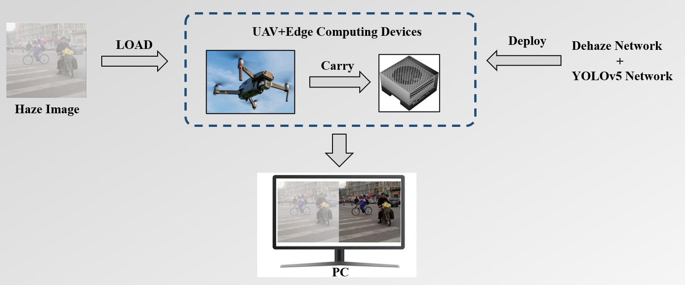

– Organized merchandise from numerous clients preparing them to be shot in photo studio.\
– Build an end-to-end dehazing network based on the SwinTransformer model under the GAN architecture, and conduct training and verification on the dehazing dataset.\
– Reduce the amount of model parameters and calculations through cheap convolution, network clipping, model quantification and other model lightweight technologies.\
– Combine the defogging network with the YOLOv5 target The target detection network is deployed on NVIDIA edge computing devices.

\
*Deep learning model deployment process*
\
*Process of the project*
