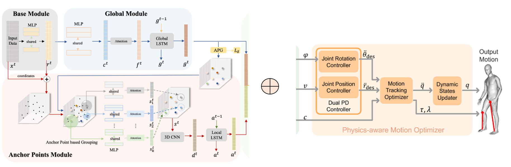

– Design a plug-and-play physics-based optimization module according to the physical characteristics of human movement.\
– Module can refined the point cloud data collected by millimeter-wave radar based on the characteristics of human movement to meet the physical constraints

\
*Framework*

